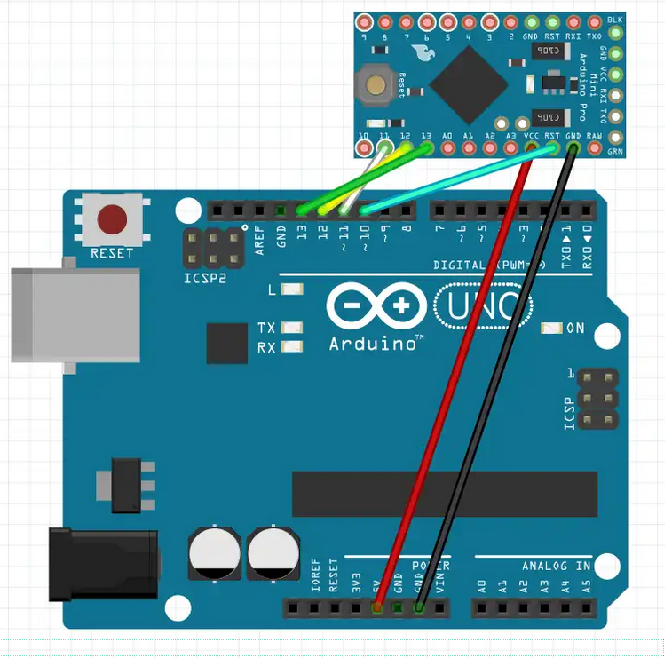
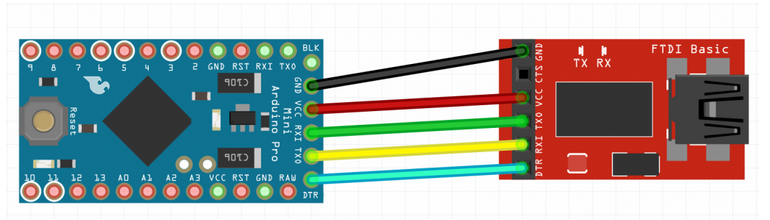
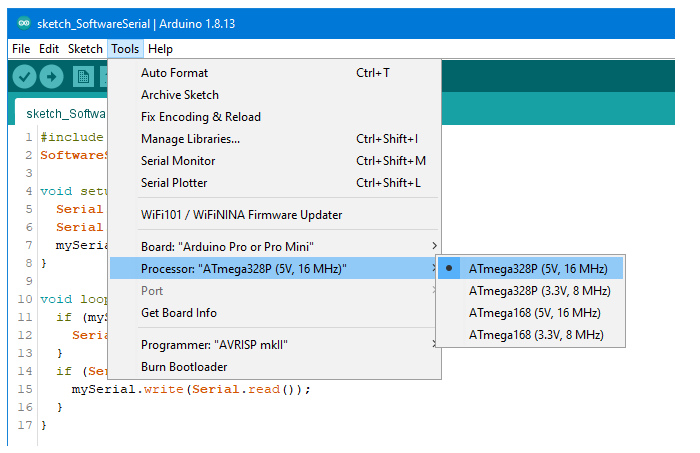

# Dominus

## Flash arduino mini pro

### Burn bootloader

1. Connect your Arduino UNO to the PC
2. in the Arduino IDE select: File – Examples – ArduinoISP – ArduinoISP
3. Board: Choose Arduino UNO, choose right port
4. Upload
5. then choose Arduino Pro Mini as a board, select the right variant
6. Programmer: “Arduino as ISP” (not: ArduinoISP!)
7. wire as per this scheme:

8. Then select in the menu: Tools – Burn Booloader.

### Upload project with USB TTL adapter and Arduino IDE

1. First, the Arduino Pro Mini is connected to the USB-to-TTL module as shown:

In the Arduino IDE:

2. choose the right port which is connected to USB-to-TTL module
3. choose “Arduino Pro or Pro Mini” as board
4. Choose the right variant (ATmega 328P 3.3V 8MHz)
5. Select and upload the sketch – and that’s it.

Note: without DTR pin, push/release de reset button on the arduino mini pro

## CC1101

https://debiaonoldcomputers.blogspot.com/2014/01/cc1101-su-arduino.html

https://www.ordinoscope.net/index.php/Electronique/MCUs/Arduino/Boards/Arduino_Pro_Mini

https://electronoobs.com/eng_arduino_tut98.php

https://www.amazon.fr/dp/B07YX92NMP?ref=ppx_yo2ov_dt_b_fed_asin_title

https://www.instructables.com/HackerBox-0034-SubGHz/

https://github.com/mcore1976/cc1101-jammer

## References

https://wolles-elektronikkiste.de/en/programming-the-arduino-pro-mini

A-Star 328PB Micro
